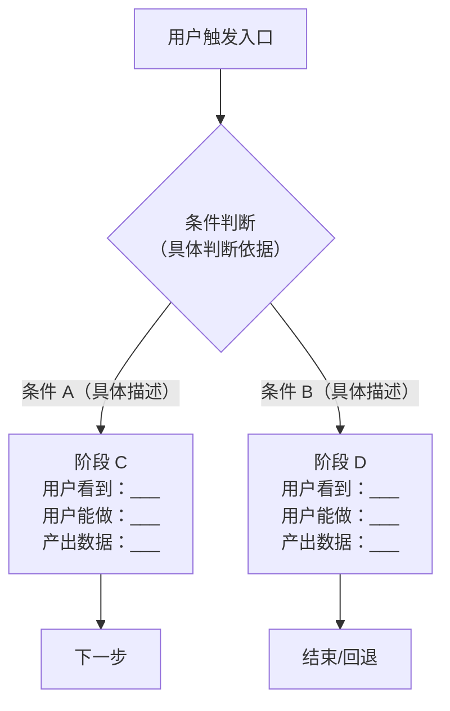

# 交互设计规范（AI 执行版）

> **使用说明**
> 本文档是给 AI 的执行指令，不是给人读的规范介绍。
> 每个章节末尾的 ` AI 必须输出` 块是强制要求，不得省略、合并或用文字描述代替。
> 遇到"禁止"标记的行为，即使用户要求也不执行，应说明原因并给出合规替代方案。

---

## 一、交互流程设计

### 1.1 何时产出流程图

**满足以下任一条件，必须产出流程图：**
- 功能涉及 2 个以上用户操作步骤
- 存在条件分支（如：已登录/未登录、有数据/无数据）
- 涉及多角色（如：用户操作 → 后端处理 → 用户看到结果）
- 需要说明回退、取消、异常路径

**只有单一线性步骤、无分支、无异常、无点击的极简场景可以省略。**

### 1.2 流程建模三步法（AI 必须按此顺序思考）

**第一步：画主干路径**
用户从入口到完成目标的最短路径，逐节点列出：用户看到什么 → 用户做什么 → 系统响应什么。

**第二步：标记分支节点**
每个判断点必须写明：
- 判断依据是什么（具体字段/条件，不能写模糊描述）
- 每个分支的去向

**第三步：补充回退与异常路径**
- 用户主动取消/退出 → 去哪里，数据是否保留
- 请求失败 → 如何提示，是否可重试
- 权限不足 → 如何引导

### 1.3 流程图输出格式（强制使用 Mermaid）



每个节点必须标注：
- **用户看到**：界面上呈现什么
- **用户能做**：可操作的行为
- **产出数据**：该节点完成后向下传什么数据

### 1.4 分支节点的写法规范

❌ **禁止这样写**（模糊，AI 无法执行，研发无法开发）：
```
是否需要上传？
  是 → 上传页面
  否 → 跳过
```

✅ **必须这样写**（具体条件明确）：
```
scene 配置项中 tabs 数组是否包含 'upload' key？
  包含 → 渲染上传区块组件
  不包含 → 跳过该区块，直接渲染下一个 tab
```

### 1.5 多阶段系统隔离规则

当系统存在多个独立引导/流程阶段时，AI **必须**检查并在设计文档中声明：

| 检查项 | 合规标准 |
|--------|---------|
| 配置隔离 | 每个阶段有独立配置对象（如 `UPLOAD_SCENES` ≠ `GUIDE_STEPS`） |
| 状态隔离 | 每个阶段有独立 store 或 ref，不共享状态变量 |
| 独立接入 | 新功能可只接入其中一个阶段，不影响另一个 |
| 命名区分 | 配置 key、store name、组件名均带阶段前缀 |

---

 **AI 必须输出（流程章节）**：
1. Mermaid 流程图，覆盖主干 + 分支 + 异常路径
2. 节点说明表（用户看到 / 用户能做 / 产出数据）
3. 若存在多阶段：隔离声明表

---

## 二、组件状态机设计

### 2.1 状态覆盖要求

**设计任何交互组件时，必须逐一定义以下状态。不能以"参考常规设计"代替。**

| 状态 | 必须说明的内容 | 常见遗漏点 |
|------|--------------|-----------|
| **默认态** | 初始外观、初始数据来源 | 忘记说明"数据从哪来" |
| **Hover 态** | 颜色/阴影/位移的具体变化 | 只写"有 hover 效果" |
| **Focus 态** | 聚焦指示器样式（边框色、ring 宽度） | 键盘导航场景遗漏 |
| **Active/按下态** | 缩放比例、颜色加深程度 | 移动端点击态遗漏 |
| **选中态** | 背景色变化、图标切换、勾选标记 | 多选时的半选态遗漏 |
| **禁用态** | 视觉灰化规则、cursor:not-allowed、不可点击 | 忘记说明何时触发禁用 |
| **Loading 态** | spinner 位置、文字替换内容、是否禁止重复触发 | 重复提交未锁定 |
| **Error 态** | 错误提示的位置、样式、消失时机（手动关闭/自动/重新操作后） | 错误消失时机未定义 |
| **空状态** | 占位图标 + 文案 + 是否有操作引导 | 空状态一片空白 |

**以下组合必须单独说明，不能合并：**
- Loading + Error（加载中失败）
- 选中 + 禁用（已选中但当前不可操作）
- 空状态 + Loading（首次加载中）

### 2.2 状态转换表（强制输出格式）

```
| 当前状态   | 触发动作         | 下一状态   | 副作用（必填）              |
|-----------|----------------|-----------|---------------------------|
| 默认       | 用户点击提交     | Loading   | 发起 API 请求；按钮 disabled |
| Loading   | 请求成功         | 成功态     | 显示成功提示；emit success 事件 |
| Loading   | 请求失败（网络）  | Error 态  | 显示错误文案；按钮恢复可点击   |
| Loading   | 请求失败（权限）  | Error 态  | 显示"无权限"文案；不显示重试  |
| Error 态  | 用户点击重试     | Loading   | 重新发起请求                 |
| Error 态  | 用户修改输入     | 默认态     | 清除错误提示                 |
```

**注意：同一触发动作对应不同错误类型时，必须分行写，不能合并为"请求失败 → Error"。**

**核心铁律：子组件不持有共享状态，只做展示和事件上报。**

---

🤖 **AI 必须输出（状态机章节）**：
1. 九态覆盖检查表（逐行填写，不能留空）
2. 状态转换表（错误类型必须分行）

---

## 三、可扩展架构设计

### 3.1 配置驱动模式（核心思想）

**判断标准：** 满足以下任一条件，必须使用配置驱动，禁止硬编码：
- 同一组件需要在不同场景下展示不同内容
- 未来可预见会新增类似场景
- 不同角色/权限看到不同功能项

**禁止行为：** 用 if/else 枚举场景 ID 控制显示逻辑，每新增场景都需要改组件代码。

**正确做法：** 将场景差异抽取为配置对象，组件只读取配置决定渲染内容，新增场景只加配置条目，不改组件逻辑。路由判断规则：场景 ID 存在于配置表中即走对应流程，不存在则跳过。

### 3.2 配置对象设计规范

AI 设计配置对象时，每个配置项必须包含以下字段，并在设计文档中以表格形式列出：

| 字段 | 类型 | 是否必填 | 说明 |
|------|------|---------|------|
| `title` | string | 必填 | 显示名称，用于页面标题、面包屑 |
| `description` | string | 必填 | 场景描述，用于引导文案 |
| `tabs` | TabConfig[] | 必填 | 区块列表，决定渲染哪些子组件 |
| `permissions` | string[] | 可选 | 访问该场景所需权限 key |
| `maxItems` | number | 可选 | 最多可选条数，不传则不限制 |

每个 Tab 配置项必须包含：

| 字段 | 类型 | 是否必填 | 说明 |
|------|------|---------|------|
| `key` | string | 必填 | 与区块注册表对应的唯一标识 |
| `label` | string | 必填 | Tab 标签显示文字 |
| `icon` | string | 必填 | 图标 name |
| `required` | boolean | 必填 | 是否必填，影响提交校验 |
| `description` | string | 可选 | 区块内的说明文案 |

### 3.3 新增场景的完整检查清单

AI 在输出"如何新增场景"说明时，必须按此清单逐项列出，不能简化：

| 步骤 | 操作 | 改动文件 | 是否影响现有功能 |
|------|------|---------|---------------|
| 1 | 在配置对象中添加新的 scene-id 条目 | `scenes.config.ts` | 否 |
| 2 | 确认新 scene-id 与上游传参一致 | 无需改代码 | 否 |
| 3 | 如 tabs 中有新 key，在区块注册表中添加对应组件 | `block-registry.ts` | 否 |
| 4 | 如需新的触发方式，在目标组件中添加推进调用 | 目标组件文件 | 否 |

---

🤖 **AI 必须输出（架构章节）**：
1. 配置对象字段说明表（含每个场景的真实 tabs 配置，不用占位符）
2. 新增场景检查清单（含改动文件列）

---

## 四、UX 微交互规范

### 4.1 动效使用规则（先看禁止项）

**以下情况禁止添加动效，AI 不得在设计文档中建议：**
- 纯文字/数字的数值变化（禁止数字滚动动画）
- 列表数据刷新（禁止整体淡入淡出）
- 页面间路由跳转（禁止全屏过渡动画）
- 高频触发的操作（如实时搜索结果更新，禁止每次结果都动）
- 表格行内容更新

**允许使用动效的场景（仅限以下）：**

| 场景 | 时长 | 缓动 | 说明 |
|------|------|------|------|
| Hover 色变 | 150ms | ease | 颜色/背景渐变 |
| 弹窗/抽屉进场 | 200ms | ease-out | 从触发点扩展或从边缘滑入 |
| 弹窗/抽屉退场 | 150ms | ease-in | 退场比进场快 |
| 蒙层渐现 | 200ms | ease | 蒙层渐现 |
| 蒙层渐隐 | 200ms | ease | 蒙层渐隐 |
| Tab 切换指示条 | 200ms | ease | 下划线平移 |
| 展开/折叠 | 200ms | ease | 高度动画（max-height） |
| 列表首次加载进场 | 250ms | ease-out | 仅首次，可加 stagger（间隔 ≤ 30ms）|
| Loading Spinner | 持续旋转 | linear | 无起止，loop |
| 成功/错误状态切换 | 200ms | ease | 图标变化 |

**所有动效时长不超过 300ms，超过即违规。**

**蒙层视觉规则：**
弹窗/抽屉出现时，对蒙层后方的页面内容施加 4px 高斯模糊（毛玻璃效果）。

### 4.2 用户反馈规范（强制要求）

以下每种用户动作对应的反馈是**最低要求**，AI 不得在设计文档中遗漏：

| 用户动作 | 立即反馈（< 16ms） | 过程反馈 | 结果反馈 |
|---------|-----------------|---------|---------|
| 点击主操作按钮 | 按下态色变 | 操作 > 300ms 时出 Loading | 成功提示或界面变化 |
| 表单提交 | 按钮变 Loading + disabled | - | 成功跳转或就近错误提示 |
| 数据选择/勾选 | 选中态立即变化 | - | 底部计数实时更新 |
| 文件拖拽进入区域 | 拖拽区高亮边框 | 上传进度条 | 文件名 + 大小展示 |
| 搜索输入 | - | debounce 300ms 后请求 | 结果列表更新或空状态 |
| 删除操作 | - | 确认弹窗 | 列表项移除 |

**错误提示位置规则：**
- 字段级错误 → 字段正下方，红色文字，12px
- 表单整体错误 → 提交按钮正上方
- 操作类错误 → 就近提示，禁止全局 Toast 打断流程
- 系统级错误（500/网络）→ 全局 Toast，3s 自动消失

### 4.3 边界情况强制覆盖

**AI 在输出任何交互设计时，必须逐条检查并说明处理方式。不允许以"参考通用规范"代替。**

| 边界情况 | 必须说明的内容 |
|---------|--------------|
| **数据为空（首次）** | 空状态 UI：图标 + 主文案 + 副文案 + 操作按钮（如有） |
| **数据为空（搜索后）** | 区分"无结果"与"加载失败"，文案不同 |
| **文本超长** | 几行后 truncate？展开方式？tooltip 触发方式？ |
| **列表超过 N 条** | N 是多少？分页还是虚拟滚动？每页几条？ |
| **网络请求慢（> 1s）** | Skeleton 还是 Spinner？超时时间？超时后提示文案？ |
| **重复提交** | Loading 期间按钮 disabled，是否还需要防抖/节流？ |
| **中途退出/关闭弹窗** | 有未保存数据时是否弹确认？确认文案是什么？ |
| **回退上一步** | 当前填写的数据是否保留？保留哪些字段？ |
| **权限不足** | 入口是否隐藏？还是置灰？进入后的提示文案和引导操作？ |
| **并发操作** | 同一功能在多 Tab 同时打开时的数据一致性策略 |

### 4.4 Tab / 标签栏交互规则

| 规则 | 说明 | 反例 |
|------|------|------|
| 默认选中第一个 | 打开时自动激活第一个 Tab，不等用户选择 | 打开时没有激活态 ❌ |
| 切换保留数据 | Tab 切换不销毁组件，使用 `v-show` 而非 `v-if` | 切换后表单清空 ❌ |
| 互斥数据提交 | 提交时只携带当前激活 Tab 的数据，其他 Tab 数据不提交 | 所有 Tab 数据一起提交 ❌ |
| 必填标记 | 必填 Tab 标签后加红色 `*`，可选 Tab 加灰色"可选"标签 | 无任何标记 ❌ |
| 选中态视觉 | 激活态：背景色变化 + 底部 2px 指示线；未选中：文字灰色 | 只靠字体粗细区分 ❌ |
| 禁用 Tab | 灰色 + cursor:not-allowed，hover 时 tooltip 说明原因 | 直接隐藏 ❌ |

---

🤖 **AI 必须输出（微交互章节）**：
1. 动效清单（仅列出本功能用到的动效，逐条标注时长和缓动）
2. 用户反馈表（按"立即 / 过程 / 结果"三列填写）
3. 边界情况覆盖表（10 项逐一填写，不能留"参考通用规范"）

---

## 五、输出产物总览（AI 交付检查清单）

每次完成交互设计后，AI 必须自检以下产物是否齐全：

```
□ 1. 流程图（Mermaid，含主干 + 分支 + 异常）
□ 2. 节点说明表（用户看到 / 用户能做 / 产出数据）
□ 3. 组件状态九态覆盖表
□ 4. 状态转换表（错误类型分行）
□ 5. 配置对象字段说明表（含真实 tabs 配置）
□ 6. 新增场景检查清单（如涉及配置驱动架构）
□ 7. 动效清单（仅本功能涉及的）
□ 8. 用户反馈表
□ 9. 边界情况覆盖表（10 项）
```

**如有产物缺失，必须在文档末尾注明原因，不能静默省略。**

---

## 六、常见违规模式（AI 自查）

在输出设计文档前，AI 必须检查是否存在以下违规：

| 违规模式 | 说明 | 正确做法 |
|---------|------|---------|
| Happy Path Only | 只设计成功路径，无错误/空状态/权限处理 | 补充状态转换表的失败行 |
| 模糊分支条件 | 分支判断写"是否需要"而非具体条件 | 写明字段名和判断值 |
| 硬编码场景 | 用 if/else 枚举场景 ID | 改为配置驱动 |
| 子组件持有共享状态 | 子组件内直接操作 store | 改为 emit → 父组件处理 |
| 动效滥用 | 对频繁更新内容添加动效 | 参照 4.1 节禁止项清单 |
| 错误提示位置错误 | 字段错误用全局 Toast | 改为字段就近提示 |
| 空状态空白 | 无数据时界面空白 | 必须有占位 UI（图标+文案） |
