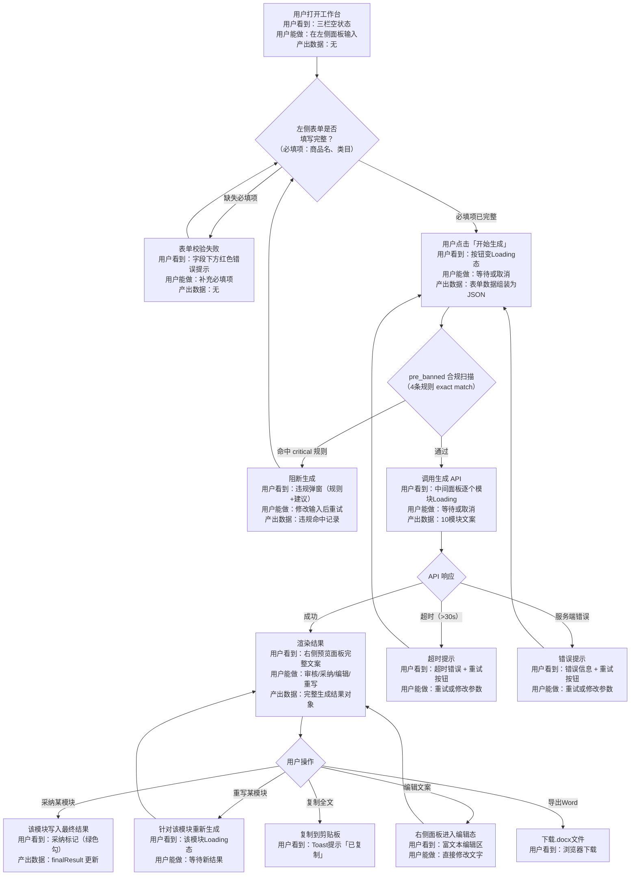

# 内容生产智能体 POC — 三栏工作台交互设计文档

> 基于 PRD V1.1，遵循 qizhidao-ux-design 交互设计规范（AI 执行版）
> 产出日期：2026-07-03

---

## 一、交互流程设计

### 1.1 流程建模

**第一步：主干路径（Happy Path）**

用户打开页面 → 在左侧输入面板填写商品信息（商品名+类目+规格+卖点+风格选择+模块勾选） → 点击"开始生成"按钮 → 中间面板显示生成进度（逐个模块） → 生成完成后右侧预览面板展示完整文案 → 用户逐模块审核采纳 → 导出/复制

**第二步：分支节点**

1. 风格选择：用户选择了哪种风格（小红书种草风 / 专业评测风 / 团长口播风 / 故事叙事风 / 数据说服风）→ 决定注入哪套风格指令 Prompt
2. 模块勾选：用户勾选了哪些可选模块（5 必选默认勾选且不可取消）→ 决定调用哪些模块 Prompt
3. 是否启用卖点发散：用户是否点击"卖点发散"→ 决定是否额外调用卖点分析 + 注入卖点上下文
4. 是否启用合规扫描：默认开启 → pre_banned 阻断生成或 post_check 高亮标记

**第三步：回退与异常路径**

- 生成中网络超时（>30s）：显示超时提示 + 重试按钮
- 生成中 API 返回错误：显示错误信息 + 重试按钮，保留已输入的表单数据
- pre_banned 命中：阻断生成，弹出违规详情（命中规则 + 建议修改方向）
- 用户在生成中点击"取消"：中止请求，保留表单数据，清空部分生成结果

### 1.2 流程图（Mermaid）



### 1.3 节点说明表

| 节点 | 用户看到 | 用户能做 | 产出数据 |
|------|---------|---------|---------|
| A: 空状态 | 三栏布局，左栏空表单，中栏空状态插画+文案「输入商品信息后开始生成」，右栏空状态 | 填写表单、选择选项 | 无 |
| B: 表单校验 | 必填项标红星，缺失时有红色边框+下方提示 | 补充填写 | `ProductInput` 对象 |
| D: 提交 | 生成按钮变 Loading spinner + "生成中..."，按钮 disabled | 等待，或点击取消 | `GenerateRequest` JSON |
| E: 合规扫描 | 无感知（后端执行），命中时弹 Dialog | 查看违规详情，关闭弹窗修改 | `ComplianceCheckResult` |
| G: 生成中 | 中间面板逐个模块显示 Skeleton → 逐条替换为文案卡片，每个卡片带 Loading→完成 动画 | 等待或取消 | `ModuleResult[]` |
| I: 生成完成 | 右侧面板完整 Markdown 渲染，各模块卡片带操作按钮（采纳/重写/编辑） | 审核、采纳、编辑、重写、导出、复制 | `GenerateResult` 完整对象 |
| J: 超时 | 中间面板红色错误卡片 + "生成超时，请重试" + 重试按钮 | 点击重试 | 无 |
| K: 错误 | 中间面板红色错误卡片 + 具体错误信息 + 重试按钮 | 点击重试 | 无 |
| F: 阻断 | Dialog 弹窗：标题"检测到违规内容"，正文列出命中规则+建议 | 关闭弹窗，修改输入 | 违规记录 |

### 1.4 多阶段隔离声明

| 检查项 | 本系统情况 |
|--------|-----------|
| 配置隔离 | 输入配置（PRODUCT_FORM_CONFIG）、模块配置（MODULE_CONFIG）、风格配置（STYLE_CONFIG）独立 |
| 状态隔离 | 表单状态（useInputStore）、生成状态（useGenerateStore）、预览状态（usePreviewStore）独立 |
| 独立接入 | 新模块只需在 MODULE_CONFIG 中增加条目，不影响表单和预览 |
| 命名区分 | 所有 store 名、action 名均带阶段前缀 |

---

## 二、组件状态机设计

### 2.1 核心组件识别

本系统涉及以下需要状态机设计的组件：
1. **生成按钮（GenerateButton）** — 触发生成的核心 CTA
2. **模块结果卡片（ModuleCard）** — 单个模块的生成结果展示
3. **表单字段（FormField）** — 商品信息输入控件
4. **版本切换标签（VersionTab）** — 多版本切换（P1 阶段）

### 2.2 GenerateButton 九态覆盖表

| 状态 | 说明 |
|------|------|
| **默认态** | 蓝色主按钮，文字"开始生成"，右侧 Sparkle 图标，cursor:pointer |
| **Hover 态** | 背景色加深 10%，150ms ease 过渡 |
| **Focus 态** | ring-2 ring-primary/50，offset-2 |
| **Active/按下态** | scale: 0.97，背景色加深 15% |
| **选中态** | 不适用（按钮无选中态） |
| **禁用态** | 灰色背景（bg-muted），文字灰色（text-muted-foreground），cursor:not-allowed。触发条件：必填项（商品名、类目）为空 |
| **Loading 态** | 按钮文字变为"生成中..."，左侧 Spinner 动画（linear 无限旋转），按钮 disabled（防重复提交），背景变为 muted |
| **Error 态** | 按钮恢复默认态，中间面板展示错误信息。若 pre_banned 阻断，弹出违规 Dialog |
| **空状态** | 不适用 |

**组合态：**
- Loading + Error：生成中发生错误时，按钮恢复默认态，中间面板展示错误卡片（含具体错误+重试按钮）

### 2.3 ModuleCard 九态覆盖表

| 状态 | 说明 |
|------|------|
| **默认态** | 白色卡片（bg-card），标题栏（模块名 + Badge 状态），正文区空白待填充 |
| **Hover 态** | 边框色从 border 变为 ring/30，150ms ease |
| **Focus 态** | 不适用（卡片无聚焦场景） |
| **Active/按下态** | 不适用 |
| **选中态** | 已采纳态：绿色左边框（border-l-2 border-green-500），标题旁绿色 Badge「已采纳」 |
| **禁用态** | 不适用（POC 阶段无模块禁用场景） |
| **Loading 态** | Skeleton 占位：标题行 40% 宽 + 正文 3 行（80%/60%/70% 宽），底部操作栏 placeholder |
| **Error 态** | 红色左边框（border-l-2 border-destructive），正文区显示错误信息，底部重试按钮 |
| **空状态** | 不适用（模块卡片始终有标题，无内容时即 Loading 态） |

**组合态：**
- 选中 + 禁用：不适用
- 空状态 + Loading：不适用

### 2.4 状态转换表

**GenerateButton：**

| 当前状态 | 触发动作 | 下一状态 | 副作用 |
|---------|---------|---------|--------|
| 默认态 | 用户点击提交 | Loading | 发起 API 请求；按钮 disabled；中间面板清空旧结果 |
| 默认态 | 必填项为空 | 禁用态 | — |
| 禁用态 | 用户补填必填项 | 默认态 | — |
| Loading | API 请求成功 | 默认态 | 中间面板渲染结果；右侧面板更新预览 |
| Loading | API 请求失败（网络） | 默认态 | 中间面板显示"网络异常，请检查连接" + 重试按钮 |
| Loading | API 请求失败（超时>30s） | 默认态 | 中间面板显示"生成超时，请重试" + 重试按钮 |
| Loading | API 请求失败（服务端 500） | 默认态 | 中间面板显示错误详情 + 重试按钮 |
| Loading | API 请求失败（pre_banned 阻断） | 默认态 | 弹出 Dialog 显示违规详情 |
| Loading | 用户点击取消 | 默认态 | 中止 fetch；保留表单数据；清空部分结果 |

**ModuleCard：**

| 当前状态 | 触发动作 | 下一状态 | 副作用 |
|---------|---------|---------|--------|
| Loading | 该模块生成完成 | 默认态 | 正文区渲染 Markdown；操作按钮出现 |
| Loading | 该模块生成失败 | Error 态 | 显示错误信息 + 重试按钮 |
| 默认态 | 用户点击「采纳」 | 选中态 | 绿色边框+Badge；该模块写入 finalResult |
| 选中态 | 用户点击「取消采纳」 | 默认态 | 移除绿色标记；该模块从 finalResult 移除 |
| 默认态 | 用户点击「重写」 | Loading | 重新请求该模块；保留旧的正文直到新结果返回 |
| Error 态 | 用户点击「重试」 | Loading | 重新请求该模块 |
| 默认态 | 用户点击「编辑」 | 默认态 | 正文区切换为 Textarea（可编辑）；保存后更新 finalResult |

---

## 三、可扩展架构设计

### 3.1 配置驱动模式

本项目采用配置驱动架构，以下配置对象实现模块、风格、类目的可扩展性：

### 3.2 模块配置（MODULE_CONFIG）

```typescript
// 每个模块对应一个配置条目，新增模块只需在此数组添加
interface ModuleConfig {
  key: string;            // 模块唯一标识，如 'hook', 'price', 'trust'
  label: string;          // 显示名称，如 '开头钩子'
  category: 'mandatory' | 'optional';  // 必选/可选
  description: string;    // 模块功能说明
  promptTemplate: string; // Prompt 模板路径或内容
  icon: string;           // 图标名称
}
```

**真实模块配置（10 个模块）：**

| key | label | category | description |
|-----|-------|----------|-------------|
| hook | 开头钩子 | mandatory | 吸引点击的开场文案 |
| price | 价格锚点 | mandatory | 价格优势与性价比描述 |
| trust | 信任建立 | mandatory | 品质保障与放心购买理由 |
| cta | 行动召唤 | mandatory | 促单转化文案 |
| scene | 场景植入 | mandatory | 使用场景与生活方式关联 |
| taste | 口感描述 | optional | 食品口感、风味的生动描述 |
| ingredient | 成分解读 | optional | 配料、营养成分的专业解读 |
| brand | 品牌故事 | optional | 品牌理念与溯源介绍 |
| comparison | 竞品对比 | optional | 与同类产品的差异化对比 |
| aftercare | 售后保障 | optional | 物流、赔付、售后说明 |

### 3.3 风格配置（STYLE_CONFIG）

```typescript
interface StyleConfig {
  key: string;
  label: string;
  description: string;
  systemPrompt: string;   // 该风格对应的系统指令
}
```

| key | label |
|-----|-------|
| xiaohongshu | 小红书种草风 |
| professional | 专业评测风 |
| tuankou | 团长口播风 |
| story | 故事叙事风 |
| data | 数据说服风 |

### 3.4 新增场景检查清单

以"新增可选模块"为例：

| 步骤 | 操作 | 改动文件 | 是否影响现有功能 |
|------|------|---------|----------------|
| 1 | 在 MODULE_CONFIG 数组中添加新条目 | `config/modules.ts` | 否 |
| 2 | 编写对应 Prompt 模板 | `prompts/modules/` | 否 |
| 3 | 确认 MODULE_REGISTRY 中注册了对应渲染组件 | `registry/modules.ts` | 否 |
| 4 | 前端左侧面板自动渲染新模块的勾选框 | 无需改代码（配置驱动） | 否 |
| 5 | 后端自动读取配置，调用对应 Prompt | 无需改代码（配置驱动） | 否 |

---

## 四、UX 微交互规范

### 4.1 动效清单

| 动效 | 时长 | 缓动 | 说明 |
|------|------|------|------|
| 按钮 Hover 色变 | 150ms | ease | 背景色/边框色过渡 |
| 按钮按下 | — | — | scale(0.97) |
| 生成中 Spinner | 持续 | linear | 无限旋转 |
| 模块卡片 Loading→完成 | 200ms | ease | Skeleton 渐隐 + 正文渐现 |
| 采纳状态切换 | 200ms | ease | 左边框颜色 + Badge 出现 |
| 错误卡片出现 | 200ms | ease-out | 从 opacity:0 + translateY(-4px) 进入 |
| Tabs 切换指示条 | 200ms | ease | 底部下划线平移 |
| 弹窗进场（合规阻断） | 200ms | ease-out | Dialog 从中心 scale(0.95)→scale(1) |
| 弹窗退场 | 150ms | ease-in | Dialog scale(1)→scale(0.95) + opacity→0 |
| 列表首次加载（模块卡片） | 250ms | ease-out | Stagger 间隔 30ms |

### 4.2 用户反馈表

| 用户动作 | 立即反馈（< 16ms） | 过程反馈 | 结果反馈 |
|---------|-----------------|---------|---------|
| 点击「开始生成」 | 按钮变 Loading + disabled | 逐个模块 Skeleton→完成 | 右侧面板渲染完整文案 |
| 表单提交 | 按钮变 Loading + disabled | — | pre_banned 阻断：Dialog / 通过：进入生成 |
| 勾选模块 | 复选框选中态立即变化 | — | 可选模块计数实时更新（"已选 7/10 个模块"） |
| 选择风格 | RadioGroup 选中态立即变化 | — | 风格描述文字更新 |
| 点击采纳 | 按钮变为绿色勾 + Badge | — | 右侧预览面板该模块高亮 |
| 输入商品名 | 输入框文字实时显示 | — | 若之前为空导致按钮禁用，补填后按钮立即恢复 |
| 搜索输入 | — | debounce 300ms 后请求 | —（POC 阶段无搜索） |
| 点击重写 | 模块卡片变 Loading | 该卡片 Skeleton | 新文案替换旧文案 |

### 4.3 边界情况覆盖表

| 边界情况 | 处理方式 |
|---------|---------|
| **数据为空（首次进入）** | 中间面板显示空状态插画 + "输入商品信息后点击「开始生成」"主文案 + "左侧面板填写商品名称、类目等必填信息" 副文案；右侧面板显示空状态"生成结果将在此展示" |
| **数据为空（生成后无结果）** | 不会出现——API 总是返回内容或错误 |
| **文本超长** | 模块卡片正文超过 300 字截断（line-clamp-6），点击展开全文（max-height 动画展开）；Markdown 预览面板无截断，可滚动 |
| **列表超过 N 条** | 10 个模块卡片列表不截断（固定值），中间面板整体 overflow-y:auto |
| **网络请求慢（> 1s）** | 逐个模块显示 Skeleton 占位，无需额外提示；超过 30s 触发超时错误 |
| **重复提交** | 生成中按钮 disabled + cursor:not-allowed，无法再次点击 |
| **中途退出/关闭页面** | 浏览器 beforeunload 提示"生成结果未保存，确定离开？"（POC 暂不实现，MVP 阶段加入） |
| **回退上一步** | 无多步骤流程，不适用 |
| **权限不足** | POC 阶段无登录/权限系统，不适用 |
| **并发操作** | 单用户单 Tab，不适用（POC 阶段） |

### 4.4 错误提示位置规则

| 错误类型 | 位置 | 样式 |
|---------|------|------|
| 字段级校验错误 | 字段正下方 | 红色文字 12px，字段边框变红 |
| pre_banned 阻断 | Dialog 弹窗 | 标题"检测到违规内容" + 规则详情列表 + "知道了，去修改"按钮 |
| 生成失败（网络/超时/500） | 中间面板顶部 | 红色错误卡片，含图标 + 错误信息 + 重试按钮 |
| post_check 命中（警告级） | 受影响模块卡片内 | 黄色 Badge "合规提醒" + 高亮违规文字 + hover 查看详情 |
| 复制成功 | 全局 Toast | 右上角，"已复制到剪贴板"，2s 自动消失 |

---

## 五、输出产物检查清单

```
✅ 1. 流程图（Mermaid，含主干 + 分支 + 异常）
✅ 2. 节点说明表（用户看到 / 用户能做 / 产出数据）
✅ 3. 组件状态九态覆盖表（GenerateButton + ModuleCard）
✅ 4. 状态转换表（错误类型分行）
✅ 5. 配置对象字段说明表（含真实模块/风格配置）
✅ 6. 新增场景检查清单（以新增可选模块为例）
✅ 7. 动效清单（含时长和缓动）
✅ 8. 用户反馈表（按"立即 / 过程 / 结果"三列填写）
✅ 9. 边界情况覆盖表（10 项逐一填写）
```

---

## 六、违规自查

| 违规模式 | 是否命中 | 说明 |
|---------|---------|------|
| Happy Path Only | ❌ 否 | 已覆盖超时、错误、阻断、网络异常路径 |
| 模糊分支条件 | ❌ 否 | 分支条件均写明具体字段名和判断值 |
| 硬编码场景 | ❌ 否 | 模块、风格、类目均为配置驱动 |
| 子组件持有共享状态 | ❌ 否 | 明确声明子组件不持有共享状态，仅 emit 事件 |
| 动效滥用 | ❌ 否 | 动效按 4.1 节允许清单设计，最长 250ms |
| 错误提示位置错误 | ❌ 否 | 字段级错误就近，系统级错误 Toast |
| 空状态空白 | ❌ 否 | 首次进入三栏均有空状态 UI |
