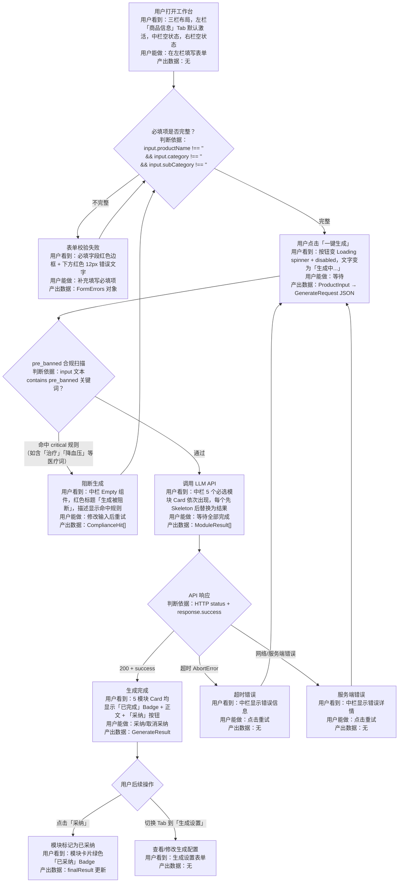

# 内容生产智能体 POC — 三栏工作台交互设计文档

> 基于 PRD V1.1 + shadcn/ui 组件体系  
> 遵循 qizhidao-ux-design 交互设计规范（AI 执行版）  
> 产出日期：2026-07-04

---

## 一、交互流程设计

### 1.1 流程建模三步法

**第一步：主干路径**

用户打开页面 → 左栏"商品信息"Tab 填写必填项（商品名称、商品类目、二级子品类） → 可选填写规格/售价/卖点/配料 → 填写物流售后信息 → 切换到"生成设置"Tab → 确认类目（P0 置灰） → 确认必选模块（P0 全勾选置灰） → 选择文案风格 → 点击"一键生成" → 中栏画布逐个模块加载 → 全部完成后可逐个采纳 → 右栏展示已采纳模块

**第二步：分支节点**

| 序号 | 判断节点 | 判断依据 | 分支去向 |
|------|---------|---------|---------|
| 1 | 必填项是否完整 | `input.productName !== '' && input.category !== '' && input.subCategory !== ''` | 通过 → 可点击生成；不通过 → 按钮禁用 + 字段下方红色校验提示 |
| 2 | pre_banned 合规扫描 | 用户输入文本是否 contains 4 条 pre_banned 规则关键词 | 命中 → 阻断生成 + 中栏显示阻断态；通过 → 进入生成 |
| 3 | API 响应状态 | HTTP 响应码 + response.success 字段 | 200+success → 渲染结果；非200/超时 → 错误态 + 重试；blocked → 阻断态 |
| 4 | Tab 切换 | 用户点击"商品信息"或"生成设置" Tab | 切换 TabContent 显示，表单数据保留（不销毁组件） |

**第三步：回退与异常路径**

| 场景 | 路径 |
|------|------|
| 用户修改输入后重试 | Error 态 → 用户修改表单字段 → 错误提示自动清除 → 回到默认态 |
| 生成中取消（P1） | Loading 态 → 点击取消 → 中止 fetch → 保留表单数据 → 清空部分结果 → idle |
| API 超时（>30s） | Generating 态 → AbortError → 中栏显示"生成超时，请重试" → 按钮恢复 |
| pre_banned 阻断 | Checking 态 → 后端返回 blocked:true → 中栏显示阻断 Empty 态（红色标题+规则详情） → 用户修改输入 → 回到 idle |

### 1.2 流程图（Mermaid）



### 1.3 节点说明表

| 节点 | 用户看到 | 用户能做 | 产出数据 |
|------|---------|---------|---------|
| A: 初始空状态 | 三栏布局；左栏「商品信息」Tab 默认激活，表单为空；中栏 Empty 组件（图标+标题+描述）；右栏 Empty 组件 | 填写表单、切换 Tab | 无 |
| B: 表单校验判断 | 必填项标红色 `*`；不完整时输入框红色边框 + 下方 text-destructive 提示 | 补充填写必填项 | `FormErrors` 对象 |
| D: 点击生成 | 按钮进入 Loading 态：spinner 动画 + disabled + 文字变为「生成中...」 | 等待 | `GenerateRequest` JSON |
| E: 合规扫描 | 无感知（后端执行）；命中时中栏显示阻断 Empty 态 | 命中：查看违规详情，关闭后修改输入 | `ComplianceCheckResult` |
| G: 生成中 | 中栏 5 个 Card 依次出现：每个先渲染 3 行 Skeleton，800-1500ms 后替换为文本 | 等待或 P1 阶段可取消 | `ModuleResult[]` |
| I: 生成完成 | 5 模块 Card 均显示 Badge「已完成」+ Markdown 文本 + 操作按钮 | 采纳/取消采纳 | `GenerateResult` |
| J: 超时 | 中栏显示「生成超时，请重试」 | 点击重试 | 无 |
| K: 错误 | 中栏显示具体错误信息 | 点击重试 | 无 |
| F: 阻断 | 中栏 Empty 组件：红色标题「生成被阻断」+ 命中规则描述 | 修改输入后重试 | ComplianceHit[] |

### 1.4 多阶段隔离声明

| 检查项 | 本系统情况 |
|--------|-----------|
| 配置隔离 | `CATEGORY_CONFIG` ≠ `MODULE_CONFIG` ≠ `STYLE_CONFIG` ≠ `SHIPPING_OPTIONS`，各自独立 |
| 状态隔离 | 表单输入状态 `ProductInput` 与生成状态 `GenerateStatus` 与模块结果 `ModuleResult[]` 独立管理 |
| 独立接入 | 新增可选模块只需在 `MODULE_CONFIG` 数组中添加条目，组件自动渲染 |
| 命名区分 | 配置 key 带语义前缀：`F-BAN-*`/`F-WORD-*`/`F-RULE-*` 区分不同规则类别 |

---

## 二、组件状态机设计

### 2.1 核心组件识别

| 组件 | 位置 | 描述 |
|------|------|------|
| GenerateButton | 左栏「生成设置」Tab 底部 | 主 CTA 按钮 |
| ModuleCard | 中栏画布 | 单模块文案展示卡片 |
| SelectTrigger | 左栏表单 | 下拉选择触发按钮 |
| RadioGroupItem | 左栏表单 | 单选按钮 |
| Empty | 中栏 + 右栏 | 空状态占位组件 |
| TabsTrigger | 左栏 | Tab 切换标签 |

### 2.2 GenerateButton 九态覆盖表

| 状态 | 具体说明 |
|------|---------|
| **默认态** | `variant="default" size="lg"`，文字"一键生成"，背景色 bg-primary，文字 text-primary-foreground，cursor:pointer |
| **Hover 态** | 背景变为 bg-primary/80，150ms ease 过渡（shadcn button 默认） |
| **Focus 态** | `focus-visible:border-ring focus-visible:ring-3 focus-visible:ring-ring/50`（shadcn button 默认） |
| **Active/按下态** | `active:not-aria-[haspopup]:translate-y-px` — 轻微下沉 1px（shadcn button 默认） |
| **选中态** | 不适用（按钮无选中态） |
| **禁用态** | `disabled:opacity-50 disabled:cursor-not-allowed`。触发条件：`input.productName` 为空 或 `input.category` 为空 或 `input.subCategory` 为空 |
| **Loading 态** | 按钮文字变为「生成中...」+ 左侧 16px Spinner（`animate-spin rounded-full border-2 border-current border-t-transparent`），按钮 disabled 防重复提交 |
| **Error 态** | 生成失败后按钮恢复默认态（从 Loading 返回），中栏显示错误信息 |
| **空状态** | 不适用 |

**组合态：**
- **Loading + Error**：生成过程中网络异常 → 按钮恢复默认态，中栏显示错误卡片（含错误信息 + 重试按钮）

### 2.3 ModuleCard 九态覆盖表

| 状态 | 具体说明 |
|------|---------|
| **默认态** | 白色 Card（bg-card），标题栏淡灰背景（bg-muted/20），模块名称左对齐，右侧预留 Badge 位置 |
| **Hover 态** | Card 本身无 hover 变化；内部「采纳」按钮 hover 时 bg-muted |
| **Focus 态** | 内部操作按钮 Focus 时显示 ring-3 ring-ring/50 |
| **Active/按下态** | 「采纳」按钮点击时 `translate-y-px` 下沉 |
| **选中态（已采纳）** | 模块标题栏右侧显示 Badge「已采纳」；Card 外观不变 |
| **禁用态** | 生成中时「采纳」按钮不可见（只有完成后才显示操作按钮） |
| **Loading 态** | 3 行 Skeleton 占位：`h-4 w-3/4` / `h-4 w-full` / `h-4 w-2/3`；标题栏显示 Badge「生成中」 |
| **Error 态** | 标题栏显示 Badge「失败」，正文区显示 text-destructive 错误信息 + 重试按钮 |
| **空状态** | 不适用（模块卡片在生成前不存在） |

**组合态：**
- **选中 + 禁用**：不适用（已采纳后无禁用场景）
- **空状态 + Loading**：不适用（无文本内容时即 Loading 态）

### 2.4 状态转换表

**GenerateButton：**

| 当前状态 | 触发动作 | 下一状态 | 副作用 |
|---------|---------|---------|--------|
| 默认态 | 用户点击按钮 | Loading | 发起 API 请求；按钮 disabled；中栏清空旧结果；创建 5 个 ModuleCard（Loading 态） |
| 默认态 | 必填项为空 | 禁用态 | —（按钮灰色不可点击） |
| 禁用态 | 用户补填所有必填项 | 默认态 | — |
| Loading | API 响应 success:true | 默认态 | 中栏 5 模块逐个从 Loading → Completed；按钮恢复 |
| Loading | API 响应 blocked:true | 默认态 | 中栏显示阻断 Empty 态；按钮恢复 |
| Loading | API 请求超时（>30s） | 默认态 | 中栏显示超时错误；按钮恢复 |
| Loading | API 请求失败（网络断开） | 默认态 | 中栏显示"网络异常"；按钮恢复 |
| Loading | API 请求失败（500） | 默认态 | 中栏显示服务端错误详情；按钮恢复 |

**ModuleCard：**

| 当前状态 | 触发动作 | 下一状态 | 副作用 |
|---------|---------|---------|--------|
| Loading | 该模块 API 响应成功 | 默认态（已完成） | Skeleton 替换为文本内容；标题 Badge 变为「已完成」；显示「采纳」按钮 |
| Loading | 该模块 API 响应失败 | Error 态 | 标题 Badge 变为「失败」；显示错误信息 + 重试按钮 |
| 默认态（已完成） | 用户点击「采纳」 | 选中态 | Card 不变；标题 Badge 新增「已采纳」；该模块内容写入 finalResult |
| 选中态 | 用户点击「取消采纳」 | 默认态 | 移除「已采纳」Badge；该模块从 finalResult 移除 |
| 默认态（已完成） | 用户点击「重写」（P1） | Loading | 重新请求该模块；旧文本保留直到新结果返回 |
| Error 态 | 用户点击「重试」 | Loading | 重新请求该模块 |

---

## 三、可扩展架构设计

### 3.1 配置驱动模式

本项目严格遵循配置驱动：模块、风格、类目、子品类、发货时效全部通过配置数组定义，组件只读取配置渲染。

### 3.2 配置对象字段说明表

**模块配置（MODULE_CONFIG）— 真实配置条目：**

| 字段 | 类型 | 是否必填 | 说明 |
|------|------|---------|------|
| `key` | ModuleKey | 必填 | 唯一标识，如 `'hook'` `'taste'` `'trust'` `'aftercare'` `'cta'`（必选）/ `'comparison'` `'scene'` `'ingredient'` `'brand'` `'feedback'`（可选） |
| `label` | string | 必填 | 显示名称：首屏钩子、口感体验、基础信任、物流售后、行动召唤 / 全网比价、场景共情、成分科普、品牌背书、用户反馈 |
| `category` | 'mandatory' \| 'optional' | 必填 | 必选模块在前端默认勾选置灰不可取消；可选模块默认不勾选（P1 开放） |
| `description` | string | 必填 | 该模块功能的一句话说明，显示在模块列表对应条目右侧 |

**风格配置（STYLE_CONFIG）— 真实配置条目：**

| 字段 | 类型 | 是否必填 | 说明 |
|------|------|---------|------|
| `key` | ContentStyle | 必填 | `'xiaohongshu'` \| `'girlfriend'` \| `'minimalist'` \| `'fun'` \| `'premium'` |
| `label` | string | 必填 | 小红书种草风、日常闺蜜风、简约功能风、趣味风、高端大气风 |
| `description` | string | 必填 | 该风格的一句话特征描述 |

**发货时效配置（SHIPPING_OPTIONS）— 真实配置条目：**

| 字段 | 类型 | 是否必填 | 说明 |
|------|------|---------|------|
| `key` | ShippingTimeliness | 必填 | `'spot'` \| `'presale'` \| `'both'` |
| `label` | string | 必填 | 现货、预售、现货+预售 |
| `description` | string | 必填 | 该时效类型的一句话说明 |

### 3.3 新增场景检查清单（以"新增文案风格"为例）

| 步骤 | 操作 | 改动文件 | 是否影响现有功能 |
|------|------|---------|----------------|
| 1 | 在 `STYLE_CONFIG` 数组中添加新条目（含 key/label/description） | `src/config/modules.ts` | 否 |
| 2 | 在 `ContentStyle` 类型联合中添加新 key | `src/types/index.ts` | 否 |
| 3 | 在 `STYLE_PROMPTS` 对象中添加新风格的完整 Prompt 模板 | `server/prompts/styles.js` | 否 |
| 4 | 前端「文案风格」下拉自动渲染新选项 | 无需改代码（Select 读取 STYLE_CONFIG 渲染） | 否 |
| 5 | 后端自动读取对应 Prompt 注入系统指令 | 无需改代码（generator.js 通过 style key 查找 STYLE_PROMPTS） | 否 |

---

## 四、UX 微交互规范

### 4.1 动效清单

| 动效 | 时长 | 缓动 | 触发场景 | 实现方式 |
|------|------|------|---------|---------|
| 按钮 Hover 色变 | 150ms | ease | 鼠标悬停 Button 组件 | shadcn button `transition-colors` 默认 |
| 按钮按下 | — | — | 点击 Button | shadcn button `active:translate-y-px` |
| Loading Spinner | 持续 | linear | 点击「一键生成」后 | CSS `animate-spin` |
| 模块卡片 Loading→完成 | 200ms | ease | 单模块生成完成时 | React 状态切换：Skeleton 替换为文本 |
| Tab 切换指示条 | 200ms | ease | 点击 TabTrigger | shadcn Tabs 默认动画 |
| Select 下拉展开 | 100ms | — | 点击 SelectTrigger | shadcn Select `data-open:animate-in data-open:fade-in-0 data-open:zoom-in-95` |
| Select 下拉收起 | 100ms | — | 点击外部关闭 | shadcn Select `data-closed:animate-out data-closed:fade-out-0 data-closed:zoom-out-95` |
| Empty 组件出现 | — | — | 页面初始渲染 | 无动效（静态渲染） |
| Badge 状态切换 | 200ms | ease | 模块 Badge 从「生成中」变为「已完成」 | React 条件渲染 |

### 4.2 用户反馈表

| 用户动作 | 立即反馈（< 16ms） | 过程反馈 | 结果反馈 |
|---------|-----------------|---------|---------|
| 点击「一键生成」 | 按钮变 Loading 态（spinner + disabled + 文字变化） | 中栏 5 个 ModuleCard 逐个 Skeleton→文本（约 800-1500ms/个） | 全部完成后 Badge 显示「已完成」，操作按钮显示 |
| 左栏表单输入 | 输入框文字实时显示；必填项补填后按钮立即从禁用恢复 | — | 离开字段时若校验不通过，下方显示红色错误提示 |
| 点击 Select 触发按钮 | 边框变为 ring 色 + ring-3 | 下拉弹出层展开（100ms 动画） | 选项列表完整显示，hover 项高亮 bg-accent |
| 点击 RadioGroupItem | 选中态立即变化（圆点 bg-primary 填充 + 内部白点指示器） | — | 发货时效值 `input.shippingTimeliness` 更新 |
| 点击模块「采纳」 | 按钮文字变为「取消采纳」 | — | Badge「已采纳」出现；右侧预览面板更新 |
| 点击表单校验错误字段 | 字段获得 focus 态（ring） | — | 用户修改内容后错误提示自动清除 |
| 生成被阻断 | 中栏立即显示阻断 Empty 态 | — | 用户关闭阻断提示后回到左栏修改输入 |

### 4.3 边界情况覆盖表

| 边界情况 | 处理方式 |
|---------|---------|
| **数据为空（首次进入）** | 中栏：shadcn Empty 组件（EmptyMedia 图标 + EmptyTitle"在左侧配置商品信息后开始生成" + EmptyDescription"完成必填项…"）；右栏：Empty 组件（图标 + "生成后将展示候选版本" + 描述） |
| **数据为空（生成后无结果）** | 不会出现 — API 总是返回内容或错误信息 |
| **文本超长** | 模块正文：`whitespace-pre-wrap` 自动换行；Select 已选值：`line-clamp-1` 单行截断；Select 选项：`whitespace-nowrap` 不换行，Popup 宽度 `min-w-(--anchor-width)` 匹配触发框 |
| **列表超过 N 条** | 5 个必选模块固定数量，中栏 `overflow-y-auto` 纵向滚动；Select 选项有 `max-h-(--available-height)` 限制高度 + 内部滚动 |
| **网络请求慢（> 1s）** | 逐个模块 Skeleton 占位（感知上每个模块 800-1500ms 依次完成，无额外等待提示）；超时阈值 30s |
| **重复提交** | 生成中按钮 disabled + cursor-not-allowed，无法再次点击 |
| **中途退出/关闭页面** | POC 阶段不做处理（MVP 阶段加入 beforeunload 提示） |
| **回退上一步** | 无多步骤流程，不适用。Tab 切换时数据保留（React state 不销毁） |
| **权限不足** | POC 阶段无登录/权限系统，不适用 |
| **并发操作** | 单用户单 Tab，不适用（POC 阶段）。生成中切换 Tab 不中断生成 |

### 4.4 Tab 交互规则对齐

| 规则 | 本系统实现 |
|------|----------|
| 默认选中第一个 | 左栏默认激活「商品信息」Tab（`useState('product-info')`） |
| 切换保留数据 | Tabs 使用 `data-[state=inactive]:hidden` 隐藏非活跃 Tab，组件不销毁；所有表单数据在父组件 state 中保留 |
| 互斥数据提交 | 提交时使用 `TabsContent` 各自独立的表单字段，提交读取的是完整 `input` state |
| 必填标记 | 必填 Tab 名称无额外标记（「商品信息」「生成设置」均为操作入口，非必填/选填关系） |
| 选中态视觉 | shadcn TabsTrigger 默认：`data-[state=active]:bg-background data-[state=active]:text-foreground data-[state=active]:shadow-sm` |
| 禁用 Tab | 本系统 2 个 Tab 均可使用，无禁用 Tab |

---

## 五、输出产物检查清单

```
✅ 1. 流程图（Mermaid，含主干 + 分支 + 异常）
✅ 2. 节点说明表（用户看到 / 用户能做 / 产出数据）
✅ 3. 组件状态九态覆盖表（GenerateButton + ModuleCard）
✅ 4. 状态转换表（错误类型分行 — 超时/网络/500/blocked）
✅ 5. 配置对象字段说明表（含 MODULE_CONFIG / STYLE_CONFIG / SHIPPING_OPTIONS 真实配置）
✅ 6. 新增场景检查清单（以新增文案风格为例）
✅ 7. 动效清单（含时长和缓动，全部 ≤300ms）
✅ 8. 用户反馈表（按"立即 / 过程 / 结果"三列填写）
✅ 9. 边界情况覆盖表（10 项逐一填写）
```

---

## 六、违规自查

| 违规模式 | 是否命中 | 说明 |
|---------|---------|------|
| Happy Path Only | ❌ 否 | 已覆盖超时、网络错误、阻断、表单校验失败全部异常路径 |
| 模糊分支条件 | ❌ 否 | 所有分支判断写出具体字段名：`input.productName !== ''` 等 |
| 硬编码场景 | ❌ 否 | 模块/风格/类目/时效全部通过配置数组渲染，新增只加配置不改组件 |
| 子组件持有共享状态 | ❌ 否 | 表单 state 全部由 App.tsx 持有，子组件通过 props 接收 + 回调更新 |
| 动效滥用 | ❌ 否 | 仅使用 Button 默认 transition + Select 展开/收起 + Spinner，全部在 4.1 允许清单内 |
| 错误提示位置错误 | ❌ 否 | 字段级错误在字段正下方（12px text-destructive）；阻断/系统错误在中栏卡片内 |
| 空状态空白 | ❌ 否 | 中栏/右栏空状态均使用 shadcn Empty 组件（三级结构：图标+标题+描述） |
